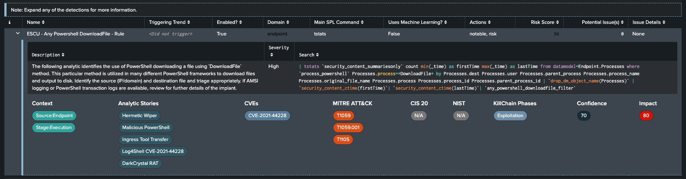
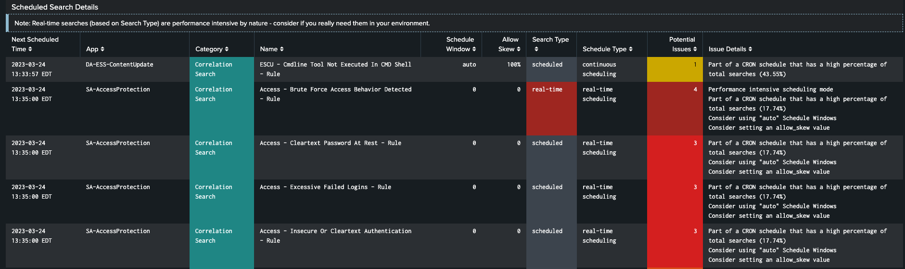

# SA-DetectionInsight

## Overview

### About SA-DetectionInsight

|                       |                                                         |
|-----------------------|---------------------------------------------------------|
| Version               | 1.0.2                                                   |
| Visible in Splunk Web | No.                                                     |

### Release Notes

**v1.0.0** - Initial release

**v1.0.1** - Released 2023-03-24

_Overview_

- Added the ability to add checks based on unmanaged annotations, for example to map Atomic Red Team Test GUID(s) to detections

_Detection Details_

- Now includes a column to identify if a detection uses machine-learning features
- Add Risk Score to the table, removed MITRE Technique (can still filter on it)
- Added 10 different checks for potential issues
- Added Confidence and Impact details to the expanded detection section
- Minor cosmetic improvements

_Scheduling Details_

- Added additional checks for potential issues

**v1.0.2** - Released _TBD_

_MITRE Att&ck Details_

- Added the ability to filter the MITRE visualization to a specific [MITRE Matrix](https://attack.mitre.org/matrices/)
- The visualization now shows subtechniques as well
- Added the ability to show MITRE coverage for external products, see the `lookups` section below for details

Make sure to upgrade the prerequisite [MITRE ATTCK Heatmap visualisation](https://splunkbase.splunk.com/app/5742) to the latest version - 1.6.1 for this to work.


## Description

A supporting Add-on for Splunk Enterprise Security providing additional insights into your security detections.

## What is it ?

It's a Splunk supporting add-on (SA) built for Splunk Enterprise Security (ES) that provides an additional view that aims to help users answer the following questions (amongst others):

- Which security detections in my environment have drilldowns or not?
- Which ones generate notables/risk/other actions?
- Which ones are mapped to `<insert security framework here>` or not?
- Which ones trigger and what is the trend?
- How are my searches/alerts/correlation searches scheduled?  Are there bottlenecks or other issues?
- How can I see changes made to my detections (enabled/disabled/modified)?
- How does my current detection posture maps to MITRE?  What about triggered detections?  How did my posture evolve vs. MITRE over time? etc.
- What commands are used in my detections?  Are any using commands known to be slower/have limits? 
- etc.

It's meant to be integrated into your ES installation's navigation.  See details below.

## Compatibility

The current version of this app is compatible with:

- Splunk 8.x, 9.x
- Splunk Enterprise Security 6.x, 7.x

## Installation & Configuration

- Install any dependencies (see below).
- Install the supporting add-on to your Splunk Search Head(s):

	**(On-premises) Install on a single instance**

	If your Splunk Enterprise deployment is a single instance, install the supporting add-on to your single instance. You can use the Install app from file feature in the Manage Apps page in Splunk Web to install the package, or install it manually using the command line.

	After you install the supporting add-on, run the preconfigured saved search named `DetectionInsight - All Saved Searches - Lookup Gen` and add the provided dashboard to your Splunk ES navigation... and voilà.  For more information, see the *Configuration* section below.

	**(On-premises) Install in a non-clustered distributed environment**

	If your Splunk Enterprise deployment is distributed and non-clustered, follow these steps:

	+ If you are installing to one or more independent search heads, follow your preferred method of deploying the app. You can do any of the following:

		* Follow the Install app from file wizard on the Manage Apps screen in Splunk Web.
		* Install manually using the command line.
		* Use a deployment server to deploy the unconfigured packages to your search heads. Do not configure the app prior to deploying it.

	**(On-premises) Install in a clustered distributed environment**

	If your Splunk Enterprise deployment has one or more search head cluster(s), use the [Deployer](https://docs.splunk.com/Documentation/Splunk/latest/DistSearch/PropagateSHCconfigurationchanges) to deploy the app to your cluster(s).

    **Install on Splunk Cloud**

    If you're using Splunk Cloud, follow the Private App installation process documented [here](https://docs.splunk.com/Documentation/SplunkCloud/latest/Admin/PrivateApps) for your version and current Splunk Cloud experience (Classic/Victoria).  

    **Note:** This is subject to change once the supporting add-on is formally published on [Splunkbase](https://splunkbase.splunk.com).

## Dependencies

The following dependencies are required by the dashboards in this supporting add-on:

### Premium Apps

- Splunk Enterprise Security (of course!)

### Visualizations
- [Status Indicator - Custom Visualization](https://splunkbase.splunk.com/app/3119)
- [MITRE ATTCK Heatmap for Splunk](https://splunkbase.splunk.com/app/5742)
- [Sunburst Viz](https://splunkbase.splunk.com/app/4550)
- [Event Timeline Viz](https://splunkbase.splunk.com/app/4370)

## Configuration

### Ensuring the main lookup is created/populated

A saved search named `DetectionInsight - All Saved Searches - Lookup Gen` is provided with the add-on which takes care of generating and maintaining the backing lookup (`all_saved_searches.csv`) that drives most of the new view.  It has a default hourly schedule.
This is done for performance reasons as it's much faster currently then the native `REST` call (approx. _15-20x_).

Upon first opening the new view, if the lookup has not been populated, you'll be asked to do so and can click on the provided link to run the relevant saved search:


Also, feel free to adapt the saved search schedule/frequency according to your needs/preferences.

You can confirm that the lookup is properly populated separately by running the following search:

`| inputlookup all_saved_searches.csv`

If that returns events, it's correctly setup.

In case you would prefer to have real-time data instead of relying on a lookup (at the cosst of a performance hit), you can change the base search in the provided dashboard from:


to:


**That's it!**

### Adding the provided Dashboard/view to Enterprise Security

To add the provided view to your Splunk Enterprise Security installation, navigate to Splunk Enterprise Security and from the application navigation go to **Configure** -> **General** -> **Navigation**.  From there you can add the provided view directly using the **Add New View** button, or alternatively, add a new collection and then add the view into that new collection.  The provided view is named `Security Detections Insights`.  Ensure to save your changes to the navigation when done.


More details can be found [here](https://docs.splunk.com/Documentation/ES/latest/Admin/Customizemenubar).

Here's an example of adding a new collection named `Insights` and then adding the provided view to it:


After refreshing the updated navigation should show your new collection and view:


## Lookups

Two additional lookups are provided with this add-on to add contextual descriptions as tooltips for CIS20 controls and NIST functions/categories.

### Additional MITRE product detections

Users can also **optionally** map MITRE detections from other products by adding the information to the `other_mitre_detections_by_product.csv` lookup file.
Working examples for [Aurora Agent](https://www.nextron-systems.com/aurora/) and ExtraHop are available under `lookups/contrib`.  Information added to this lookup will become available in the **MITRE Att&ck Details** tab if provided.

### Generating the `contrib` lookups

#### Aurora EDR

Here's an example (MacOS/zsh) of generating the detection content provided with the Aurora EDR Agent, which is based on open source [Sigma rules](https://github.com/SigmaHQ/sigma):

```sh
brew install yq
git clone git@github.com:SigmaHQ/sigma.git
cd sigma/rules
(echo "Product,Detection,Additional_Information,Technique" && yq -N -o=csv '["Aurora EDR", .title, .description | trim, .tags // [] | join(",") | sub("attack.t","T")]' ./**/*.yml) > aurora_mitre_detections.csv
```

## What does it look like?

The additional view provides the following insights arranged over multiple tabs on the same dashboard:

The **Overview** tab shows the total number of enabled security detections available as well as the number of enabled detections and of those filtered shows:

- How many have a Contributing Event search (drilldown)
- How many are configured to generate Notable events
- How many are configured to add risk for use in the Risk-Based Alerting framework
- If any are using the Threat Intelligence Management integration
- How many are mapped to each of the main Cybersecurity Security frameworks


Any of these can be expanded to get the details around which detection match the corresponding check or not by using the caret on the leff of each row.


Finally, a sunburst visualization give users an idea of the distribution of Detections by Status, Security Domain & Data Model used.

The **Detection Details** tab provides more information on selected Security Detection, including:

- Their triggering trend (Last 24hrs by default)
- Their source (application, etc.)
- Their status (enabled/disabled)
- Their related security domain
- The main SPL Command used for the underlying search
- If the detection uses Machine Learning or not
- The adaptive actions used
- The MITRE ATT&CK Technique(s) covered
- Any potential issues


Any row can similarly be expanded here as well to provide more information:



This tab also shows any changes to Security Detection over the selected time window:


**Note:** The screenshot shown above is for **Splunk Enterprise**.  This feature is a little more limited when using Splunk Cloud at the moment due to the unavailability of the `_configTracker` internal index.  If this is a feature that would be valuable to you, I would encourage you to vote for it to be considered/added [here](https://ideas.splunk.com/ideas/PLECID-I-537).

The **MITRE Att&ck Details** tab show you details around your detections and how they map to the MITRE Att&ck security framework.  You can optionally view different versions of the MITRE matrices (Enterprise, ICS, Mobile, Containers, etc.).
You'll be presented with:

- Your current detection coverage
- The additional coverage available but currently not in use
- Coverage for other external solutions, if provided (see the `Lookups` section)


- Triggered detections coverage


- How your posture has evolved vs. MITRE based on changes to your Security Detections over time


**Note:** The screenshot shown above is for **Splunk Enterprise**.  This feature is a little more limited when using Splunk Cloud at the moment as explained in the previous note above.

Finally, the **Scheduling Details** tab will provide you with an overview of your Security Detections scheduling and optionally allow you to also see alerts and saved searches scheduled:


Next, details on Scheduled Searches is also displayed, providing you with a clear view of anything related to scheduling your detections as well as potential issues:



Additionally, a grouping by CRON schedule gives you an effective view into potential bottlenecks:


The last panel on this tab gives you a visual overview of your scheduled searches distribution:


## Notes & Feedback

I plan to keep on improving this add-on, for example by adding additional checks, reporting more potential issues, displaying scheduling bottlenecks in an even better manner, allowing updates to underlying configurations directly, etc.

If you have feedback on this supporting add-on for Splunk ES (improvement ideas, issues, questions), feel free to contact me via email or open an issue on this project on GitHub.

This add-on was run through [AppInspect](https://dev.splunk.com/enterprise/docs/developapps/testvalidate/appinspect/) and any issues corrected to the best of my knowledge.

## Credits

> Thanks to people who provided initial feedback on this add-on.  You know who you are!

> Many thanks to [Mohammed Latif](https://github.com/alatif113) for the amazing MITRE Heat Map Visualization.

> Modal dialog code from the awesome [Splunk Dev for All](https://splunkbase.splunk.com/app/4104) app by current and former Splunkers. 

> Tabs feature sourced very heavily from the blog [post](https://www.splunk.com/en_us/blog/tips-and-tricks/making-a-dashboard-with-tabs-and-searches-that-run-when-clicked.html) by Luke Murphey.